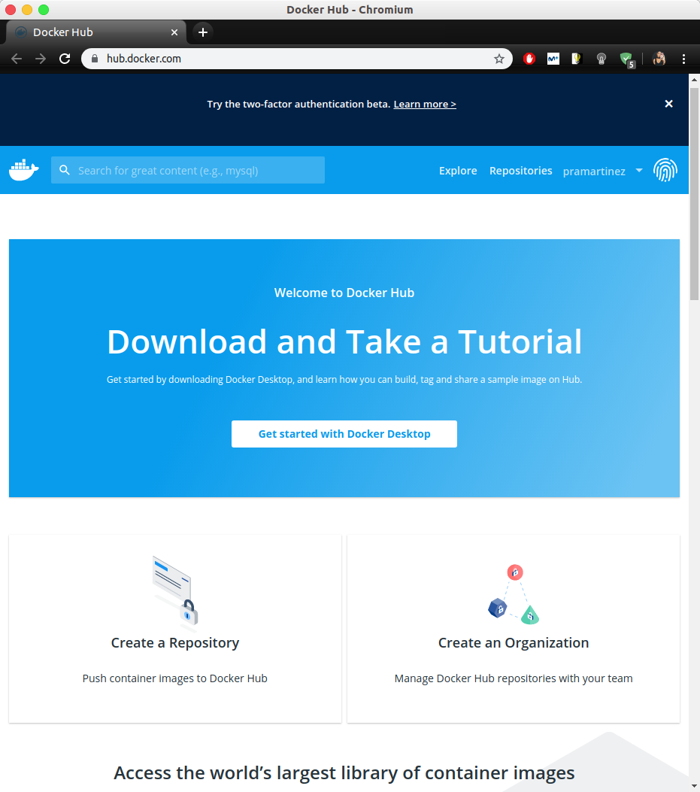
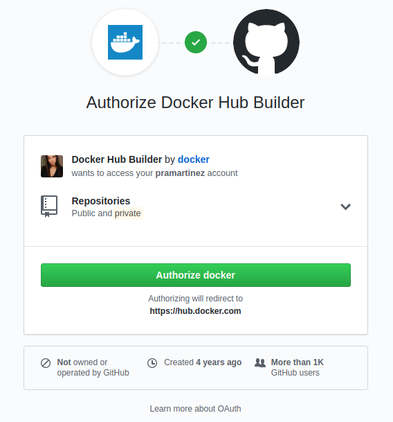
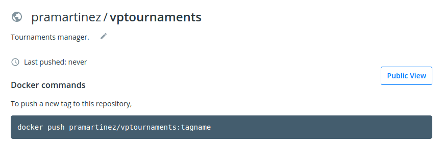
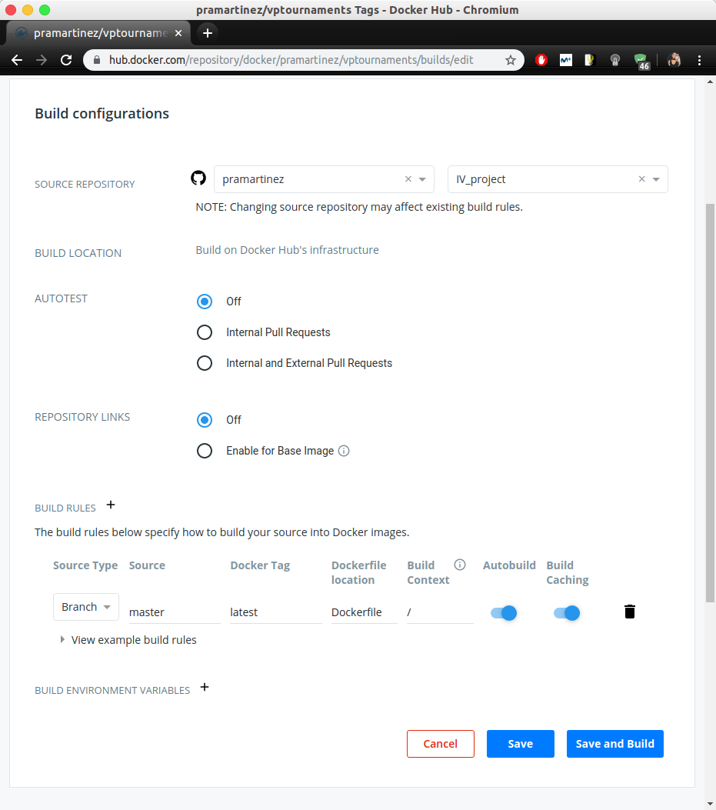
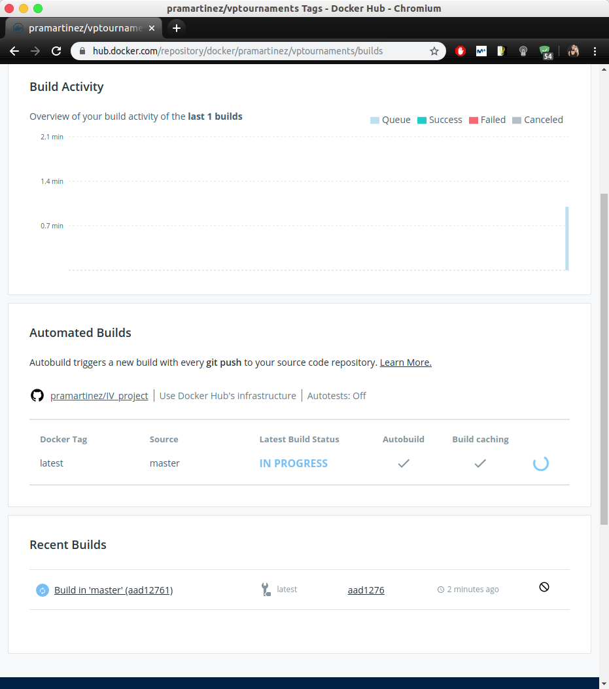
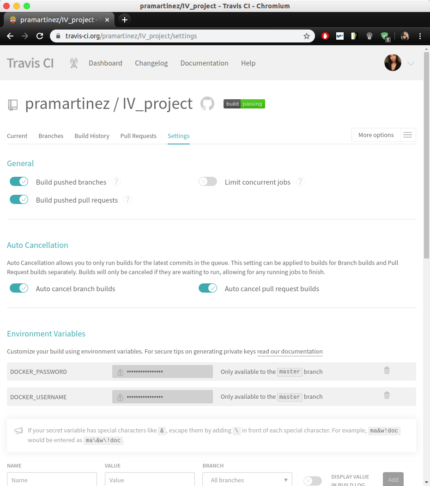

# Docker y Docker Hub

___________________________________

> Índice

<!--ts-->
- [Creación del *Dockerfile* y del *.dockerignore*:](#dockerfile)
- [Despliegue de imagen en Docker Hub:](#dockerhub)
- [Integración continua:](#ci)
<!--te-->

__________________________________________

A continuación se explica el procedimiento seguido para usar Docker en nuestro microservicio. La finalidad de usar esta herramienta es la de poder desplegar y arrancar nuestra aplicación de forma más sencilla usando contenedores. 

Para comenzar, lo que tenemos que hacer es darnos de alta en la web de Docker Hub, pues lo necesitaremos para luego poder realizar el despliegue. Una vez hecho esto, vamos a crear un ```Dockerfile``` y un ```.dockerignore```.

### Creación del *Dockerfile* y del *.dockerignore*:

<a name="dockerfile"></a>

- En dockerfile incluimos las siguientes líneas:  
	- Primero especificamos la versión de node con la que vamos a trabajar, concretamente usaremos la última versión de node soportada, que es la 10:  
    ```bash
	FROM node:10
	```  
	
	- Ahora creamos el directorio de trabajo para la aplicación:  
		```bash
		# Create app directory
		WORKDIR /vptournaments
		```
	
	- Lo que tenemos que hacer a continuación es añadir aquellos archivos y/o directorios imprescindibles para nuestro microservicio:  
		```bash
		# Bundle app source
		COPY app ./app
		COPY bin ./bin
		COPY routes ./routes
		COPY gulpfile.js ./
		```

	- Entonces ya podemos indicar la instalación de dependencias. Para esto, tenemos que copiar el package.json y el package-lock.json e indicar que la instalación de dependencias se realiza con ```npm install```:  
		```bash
		# Install dependencies
		COPY package*.json ./
		RUN npm install
		```

	- Como nuestra herramienta de construcción es Gulp, tenemos que instalarla globalmente para utilizarla en el despliege:	
		```bash
		# Install buildtool
		RUN npm install -g gulp
		```

	- Indicamos entonces el puerto, usamos la variable de entorno ```PORT``` y ```EXPORSE```. Esta última instrucción sirve para informar a Docker de que el contenedor escucha en un puerto de red concreto durante la ejecución:
		```bash
		ENV PORT 8080
		EXPOSE 8080
		```

	- Por último, especificamos el comando de despliegue de nuestro microservicio:
		```bash
		CMD [ "gulp", "start" ]
		```

- Ahora creamos un .dockerignore file. La idea es evitar que se copien módulos locales y logs de en la imagen de la aplicación, así evitamos tener archivos innecesarios o que se sobreescriban módulos instalados en la imagen. El contenido del *.dockerignore* queda así:   
```bash  
node_modules
npm-debug.log
```   

### Despliegue de imagen en Docker Hub:

<a name="dockerhub"></a>

Ahora lo que queremos es desplegar una imagen de nuestro microservicio en Docker Hub. Como se indica en la propia web de este, Docker Hub es el mayor repositorio del mundo de contendores de imágenes con una gran variedad de fuentes de contenido. Además, los usuarios de esta plataforma tienen acceso a repositorios gratuitos para así almacenar o incluso compartir sus imágenes. Como nostros también queremos ser parte de esta comunidad de usuarios, procedemos con los siguientes pasos para ello:

- En primer lugar tenemos que tener una cuenta de Docker Hub como ya indicábamos anteriormente. Por tanto, iniciamos sesión y accedemos al apartado de ```Repositories```:  
{width=50%}  

- A continuación, tenemos que crear un repositorio de Docker Hub, para ello, pulsamos a ```Create Repository +```:  
{width=75%}  

- Tenemos que indicar el nombre del mismo y que es público:
{width=50%}

- Además, conectamos nuestra cuenta de GitHub:  
{with=50%} 

- Una vez creado, vemos lo siguiente en nuestro perfil de Docker Hub:  
{width=50%}


Hasta ahora hemos conseguido crear el repositorio donde desplegaremos la imagen de nuestro microservicio. Entonces, lo que tenemos que hacer a continuación es acceder a la configuración de la construcción, es decir, a ```Build configurations```. Aquí, en el apartado de ```BUILD RULES``` especificamos cómo se va a construir nuestro recurso. Para ello, especificamos la rama (```master```), la etiqueta de Docker (```latest```), la localización del Dockerfile y, por último y muy importante, tenemos que marcar que se lleve acabo un ```Autobuild```. De esta forma conseguimos que, cada vez que hagamos ```push``` en nuestro repositorio del microservicio, se realice el despliegue de la imagen en Docker Hub:
{width=50%}

Entonces si pulsamos en ```Save and Build```, se procederá al despliegue:
{width=50%}


### Integración continua:

<a name="ci"></a>

Hemos conseguido realizar el despliegue, pero de la forma en que lo hemos hecho, no nos aseguramos que lo que estamos desplegando es correcto. Para paliar esto, tenemos que recurrir a la integración continua. Concretamente, lo que hacemos es:

- Primero modificamos nuestro archivo de configuración de travis, ```travis.yml```, indicando el siguiente nuevo apartado:  
```bash
deploy:
  provider: script
  script: bash docker_push
  on:
    branch: master
```  
Es decir, indicamos un apartado ```deploy``` para que se pueda testear este también. Dicho apartado contiene el comando que se ha de ejecutar para poder realizadlo. Dicho comando se basa en la ejecución de un script contiene el siguiente código:  
- Primero se hace un login en docker recurriendo a nuestras credenciales.
	```bash
	docker login -u $DOCKER_USERNAME -p $DOCKER_PASSWORD
	```  
- En segundo lugar, se construye una imagen de nuestra aplicación:  
	```bash
	docker build -t pramartinez/vptournaments .
	```  
- A continuación, se crea un tag para esta:  
	```bash
	docker tag vpt pramartinez/vptournaments
	```  
- Por último, se hace un push al repositorio de Docker Hub:  
	```bash
	docker push pramartinez/vptournaments
	```

Como podemos ver, en el primer paso, se ha recurrido a las credenciales del usuria pero mediante variables de entorno. Dichas variable tenemos que definirlas en la plataforma de Travis CI. Para esto tenemos que acceder a las opciones sobre ```Enviroment Variables``` e indicamos el nombre de dichas variables y su valor secreto:  
{width=50%}

Ahora y tendríamos realizado correctamente nuestro despliegue en Docker Hub. Cada vez que hagamos ```push``` localmente en nuestro repositorio, se desplegará una imagen de la aplicación en Docker Hub pasando previamente los tests de integración continua de Travis CI.


